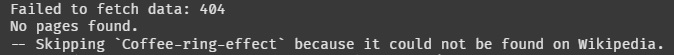
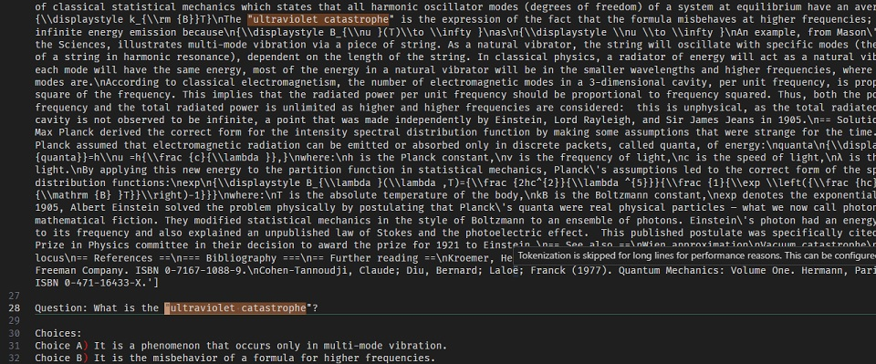
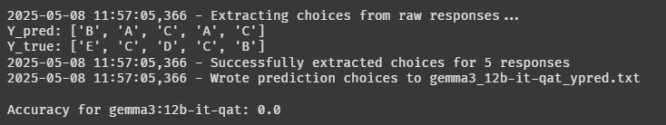
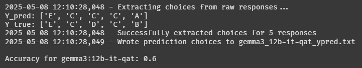

# Scientific Question Answering using RAG

Answering Multiple Choice Scientific Questions using RAG + Internet Search.

Answering questions that require knowledge of very niche topics, such as astrophysics, quantum mechanics, etc. is challenging for a lot of LLMs, especially the smaller ones (similar to the models we are using here).

That's why we are using a combination of RAG (Retrieval Augmented Generation) and Internet Search to answer these questions.

## Pipeline


As can be seen from the diagram,

- We first extract keywords from the questions using a model and a keyword generation prompt.
- Then we download the relevant pages from wikipedia for each keyword.
- We then chunk the pages into smaller chunks using a text splitter.
- We store the chunks in a vector database (ChromaDB).
- For each question, we retrieve the relevant chunks from the database.
- We then create an answering prompt using the question, the context, and the choices.
- The LLM generates the answer using the answering prompt.
- We extract the correct answer from the raw response.
- Finally, we calculate the accuracy of the model.

You can study the prompts used in this project at [src/prompts.py](src/prompts.py).

## Usage

```bash
# help
python qa_rag.py --help

# answer the first 50 questions in the dataset
python qa_rag.py --kw-model "gemma3:12b-it-qat" --answer-model "gemma3:12b-it-qat" --dataset ./data/train_data.csv --num-samples 50

# load keywords from file (--load-kw)
python qa_rag.py --kw-model "gemma3:12b-it-qat" --answer-model "gemma3:12b-it-qat" --dataset ./data/train_data.csv --num-samples 50 --chunk-size 10000 --load-kw
```

## Results

| Name                           | avg_accuracy | acc_min | acc_max | params | speed   |
| ------------------------------ | ------------ | ------- | ------- | ------ | ------- |
| Random                         | 20%          | 20%     | 20%     | 0      | -       |
| Gemma3:1b (no-context)         | 39%          | 34%     | 44%     | 1B     | 4s/it   |
| gemma3:12b-it-qat (no-context) | 78%          | -       | -       | 12B    | 26s/it  |
| gemma3:12b-it-qat (context)    | 78%          | -       | -       | 12B    | 26s/it  |
| phi4:14b (no-context)          | 78%          | -       | -       | 14B    | 40s/it  |
| GPT-4o (no-context)            | 88%          | -       | -       | 600B+  | 16s/it* |

`* GPT-4o was run using OpenAI's Infrastructure. Other models were run on a Colab T4 GPU.`

Note: Around 1/5 of the keywords get 404 from wikipedia.

## Dataset

50 multiple choice questions about various scientific topics. [train_data.csv](data/train_data.csv) and [test_data.csv](data/test_data.csv)

Example Prompt:

```text
Answer this multiple choice question using the context below.
You should be very careful to answer the question correctly. So think about the problem step by step.

Context: [INSERT CONTEXT HERE]

Question: What is the proposed name for the field that is responsible for cosmic inflation and the metric expansion of space?

Choices:
Choice A) Inflaton
Choice B) Quanta
Choice C) Scalar
Choice D) Metric
Choice E) Conformal cyclic cosmology

It's ok to talk and think about the problem but the last line of your answer should be the string 'Answer:' followed by either A, B, C, D, or E.
Example answer:
'Based on the context, the best answer would be Oxygen and because Choice A) Oxygen,
Answer: A'
```

## Future Improvements

### Web

- What if keyword is not found on wikipedia?
- What if keyword's page on wikipedia is a disambiguation page?
- Wikipedia Search is bad at searching for the paraphrases of a keyword

### Retrieval

- Reranking after retrieval
- Fine-tuning the models for Multiple Choice Question Answering
- Agentic? Right now it will search the web even for a 'hi' message!

## Problems and Discussions  

### Bad Wikipedia Search

Sometimes the generated keyword is very good but can't be found on wikipedia.

```text
Question: What is a ""coffee ring"" in physics?
```



However the page is available on wikipedia with a slightly different format: https://en.wikipedia.org/wiki/Coffee_ring_effect

Another example is the keyword "luis suarez" which is not found on wikipedia, but "luis Suarez" is!!

- ❌ https://en.wikipedia.org/api/rest_v1/page/summary/Luis_suarez

- 🟢 https://en.wikipedia.org/api/rest_v1/page/summary/Luis_Suarez

### Retrieval works well

When keyword is found on wikipedia, retrieval works pretty well.



### Manual Keywords

Manually choosing a keyword for each question that is guaranteed to be found on wikipedia results in a much better results.




From this we conclude that the retrieval and answer generation are not that bad, but the keyword generation is.

## Credits

- [Langchain Ollama docs](https://python.langchain.com/docs/integrations/providers/ollama/)
- [Langchain Ollama Embedding docs](https://python.langchain.com/docs/integrations/text_embedding/ollama/)
- [Langchain Ollama Embedding API reference](https://python.langchain.com/api_reference/ollama/embeddings/langchain_ollama.embeddings.OllamaEmbeddings.html#langchain_ollama.embeddings.OllamaEmbeddings)
- [Langchain OllamaLLM API reference](https://python.langchain.com/api_reference/ollama/llms/langchain_ollama.llms.OllamaLLM.html#langchain_ollama.llms.OllamaLLM)
- [Langchain Chroma docs](https://python.langchain.com/docs/integrations/vectorstores/chroma/)
- [Langchain Chroma API reference](https://python.langchain.com/api_reference/chroma/vectorstores/langchain_chroma.vectorstores.Chroma.html)

By Gholamreza Dar 2025
