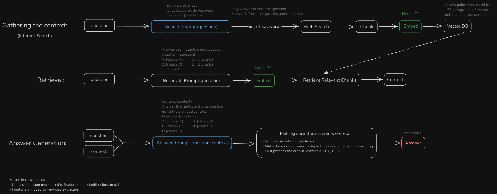

# Scientific Question Answering using RAG

Answering Multiple Choice Scientific Questions using RAG + Internet Search.

## Diagram



## Usage

```bash
python qa_rag.py
```

## Dataset

50 multiple choice questions about various scientific topics. [train_data.csv](data/train_data.csv) and [test_data.csv](data/test_data.csv)

## Results

| Name                           | avg_accuracy | acc_min | acc_max | params | speed   |
| ------------------------------ | ------------ | ------- | ------- | ------ | ------- |
| Random                         | 20%          | 20%     | 20%     | 0      | -       |
| Gemma3:1b (no-context)         | 39%          | 34%     | 44%     | 1B     | 4s/it   |
| gemma3:12b-it-qat (no-context) | 78%          | -       | -       | 12B    | 26s/it  |
| phi4:14b (no-context)          | 78%          | -       | -       | 14B    | 40s/it  |
| GPT-4o (no-context)            | 88%          | -       | -       | 600B+  | 16s/it* |

`* GPT-4o was run using OpenAI's Infrastructure. Other models were run on a Colab T4 GPU.`

## Credits

- [Langchain Ollama docs](https://python.langchain.com/docs/integrations/providers/ollama/)
- [Langchain Ollama Embedding docs](https://python.langchain.com/docs/integrations/text_embedding/ollama/)
- [Langchain Ollama Embedding API reference](https://python.langchain.com/api_reference/ollama/embeddings/langchain_ollama.embeddings.OllamaEmbeddings.html#langchain_ollama.embeddings.OllamaEmbeddings)
- [Langchain OllamaLLM API reference](https://python.langchain.com/api_reference/ollama/llms/langchain_ollama.llms.OllamaLLM.html#langchain_ollama.llms.OllamaLLM)
- [Langchain Chroma docs](https://python.langchain.com/docs/integrations/vectorstores/chroma/)
- [Langchain Chroma API reference](https://python.langchain.com/api_reference/chroma/vectorstores/langchain_chroma.vectorstores.Chroma.html)

By Gholamreza Dar 2025
